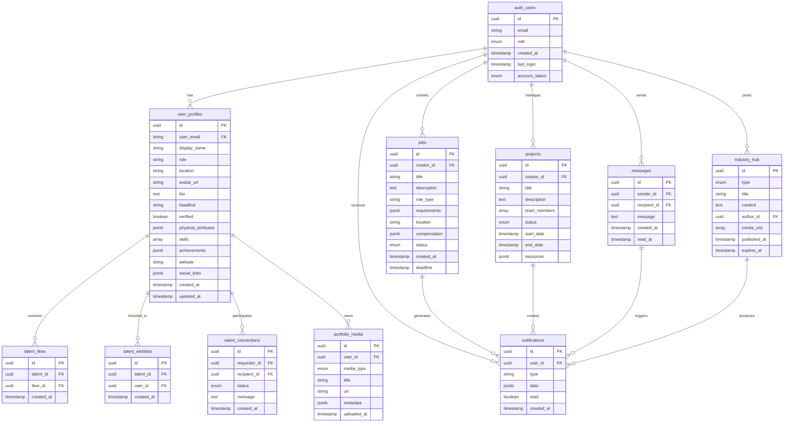

# CastLinker Database Flow Diagram

## Table Relationships Explanation

1. **auth_users → user_profiles**
   - One-to-one relationship
   - Each auth user has one profile
   - Profile contains extended user information

2. **auth_users → jobs**
   - One-to-many relationship
   - Users can create multiple job postings
   - Each job has one creator

3. **auth_users → projects**
   - One-to-many relationship
   - Users can create/participate in multiple projects
   - Each project has one creator but multiple team members

4. **user_profiles → talent_connections**
   - Many-to-many relationship
   - Users can connect with multiple other users
   - Connections have status (pending, accepted, rejected)

5. **user_profiles → portfolio_media**
   - One-to-many relationship
   - Users can have multiple media items
   - Each media item belongs to one user

6. **user_profiles → talent_likes/wishlists**
   - Many-to-many relationship
   - Users can like/wishlist multiple profiles
   - Profiles can be liked/wishlisted by multiple users

7. **Various Entities → notifications**
   - One-to-many relationship
   - Multiple entities can generate notifications
   - Each notification is linked to specific user and action

## Key Features

1. **Data Integrity**
   - Foreign key constraints
   - Cascading deletes where appropriate
   - Unique constraints on critical fields

2. **Performance**
   - Indexed foreign keys
   - Composite indexes for common queries
   - Partitioned tables for large datasets

3. **Security**
   - Row-level security policies
   - Role-based access control
   - Encrypted sensitive data

4. **Scalability**
   - Normalized structure
   - Efficient query patterns
   - JSON/JSONB for flexible data 